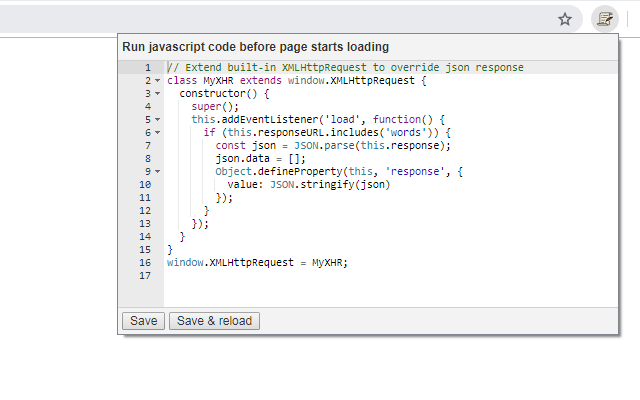

# run-js-on-page-start
Google Chrome extension to run javascript code before page starts loading

[Open in Chrome Web Store](https://chrome.google.com/webstore/detail/runjsonpagestart/jbipcfaohfaogfgfhibombphnlbfgpco)
